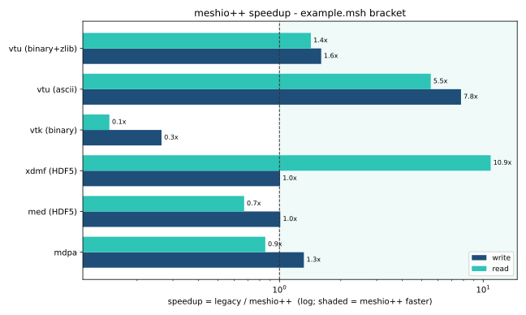
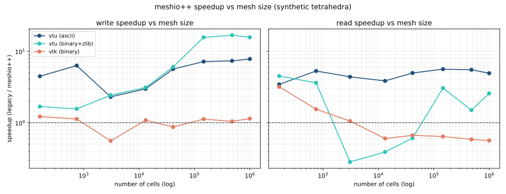

<p align="center">
  <a href="https://github.com/<org>/meshioplusplus"></a>
  <p align="center">I/O for mesh files.</p>
</p>

[](https://pypi.org/project/meshioplusplus/)
[](https://anaconda.org/conda-forge/meshioplusplus/)
[](https://repology.org/project/python:meshioplusplus/versions)
[](https://pypi.org/project/meshioplusplus/)
[](https://doi.org/10.5281/zenodo.1173115)
<!-- TODO: mint a new Zenodo DOI for meshio++ before an official release; the
     badge above still points at the original meshio project's record. -->
[](https://github.com/<org>/meshioplusplus)
[](https://pepy.tech/project/meshioplusplus)

<!--[](https://pypistats.org/packages/meshioplusplus)-->

[](https://discord.gg/Z6DMsJh4Hr)

[](https://github.com/<org>/meshioplusplus/actions?query=workflow%3Aci)
[](https://app.codecov.io/gh/<org>/meshioplusplus)
[](https://lgtm.com/projects/g/<org>/meshioplusplus)
[](https://github.com/psf/black)

There are various mesh formats available for representing unstructured meshes.
meshio++ can read and write all of the following and smoothly converts between them:

> [Abaqus](http://abaqus.software.polimi.it/v6.14/index.html) (`.inp`),
> ANSYS msh (`.msh`),
> [Ansys/APDL coded database](https://www.ansys.com) (`.cdb`, `.inp`),
> [AVS-UCD](https://lanl.github.io/LaGriT/pages/docs/read_avs.html) (`.avs`),
> [CGNS](https://cgns.github.io/) (`.cgns`),
> [DOLFIN XML](https://manpages.ubuntu.com/manpages/jammy/en/man1/dolfin-convert.1.html) (`.xml`),
> [COMSOL](https://www.comsol.com) (`.mphtxt`),
> [Exodus](https://nschloe.github.io/meshio/exodus.pdf) (`.e`, `.exo`),
> [FLAC3D](https://www.itascacg.com/software/flac3d) (`.f3grid`),
> [FLUX](https://www.altair.com/flux/) (`.pf3`),
> [FreeFem++](https://freefem.org/) (`.msh`),
> [H5M](https://www.mcs.anl.gov/~fathom/moab-docs/h5mmain.html) (`.h5m`),
> [I-deas Universal / UNV](https://www.ceas3.uc.edu/sdrluff/) (`.unv`),
> [Kratos/MDPA](https://github.com/KratosMultiphysics/Kratos/wiki/Input-data) (`.mdpa`),
> [Medit](https://people.sc.fsu.edu/~jburkardt/data/medit/medit.html) (`.mesh`, `.meshb`),
> [MED/Salome](https://docs.salome-platform.org/latest/dev/MEDCoupling/developer/med-file.html) (`.med`),
> [Modulef MFM](https://github.com/victorsndvg/FEconv) (`.mfm`),
> [Nastran](https://help.autodesk.com/view/NSTRN/2019/ENU/?guid=GUID-42B54ACB-FBE3-47CA-B8FE-475E7AD91A00) (bulk data, `.bdf`, `.fem`, `.nas`),
> [Netgen](https://github.com/ngsolve/netgen) (`.vol`, `.vol.gz`),
> [Neuroglancer precomputed format](https://github.com/google/neuroglancer/tree/master/src/neuroglancer/datasource/precomputed#mesh-representation-of-segmented-object-surfaces),
> [Gmsh](https://gmsh.info/doc/texinfo/gmsh.html#File-formats) (format versions 2.2, 4.0, and 4.1, `.msh`),
> [OBJ](https://en.wikipedia.org/wiki/Wavefront_.obj_file) (`.obj`),
> [OFF](https://segeval.cs.princeton.edu/public/off_format.html) (`.off`),
> [OpenFOAM polyMesh](https://www.openfoam.com/) (`.foam`, read-only),
> [PERMAS](https://www.intes.de) (`.post`, `.post.gz`, `.dato`, `.dato.gz`),
> [PLY](<https://en.wikipedia.org/wiki/PLY_(file_format)>) (`.ply`),
> [STL](<https://en.wikipedia.org/wiki/STL_(file_format)>) (`.stl`),
> [Tecplot .dat](http://paulbourke.net/dataformats/tp/),
> [TetGen .node/.ele](https://wias-berlin.de/software/tetgen/fformats.html),
> [SVG](https://www.w3.org/TR/SVG/) (2D output only) (`.svg`),
> [SU2](https://su2code.github.io/docs_v7/Mesh-File/) (`.su2`),
> [UGRID](https://www.simcenter.msstate.edu/software/documentation/ug_io/3d_grid_file_type_ugrid.html) (`.ugrid`),
> [VTK](https://vtk.org/wp-content/uploads/2015/04/file-formats.pdf) (`.vtk`),
> [VTU](https://vtk.org/Wiki/VTK_XML_Formats) (`.vtu`),
> [WKT](https://en.wikipedia.org/wiki/Well-known_text_representation_of_geometry) ([TIN](https://en.wikipedia.org/wiki/Triangulated_irregular_network)) (`.wkt`),
> [XDMF](https://xdmf.org/index.php/XDMF_Model_and_Format) (`.xdmf`, `.xmf`).

([Here's a little survey](https://forms.gle/PSeNb3N3gv3wbEus8) on which formats are actually
used.)

meshio++ ships a **C++20 core** (built with pybind11 + scikit-build-core) that reads and
writes most formats with zero-copy numpy at the I/O boundary, plus optional HDF5/netCDF
acceleration and a **selectable parallel backend** (STL parallel algorithms by default;
OpenMP or TBB via `-DMESHIOPLUSPLUS_PARALLEL_BACKEND=...`). Every format has a pure-Python
fallback, so behaviour and file compatibility are identical whether or not the native
libraries are present. For a standalone C++ build use `build/configure.sh` (Linux/macOS)
or `build/configure.bat` (Windows). Full docs (install, data model, per-format options,
CLI) live at
[the documentation site](https://<org>.github.io/meshioplusplus/) (sources under [`doc/`](doc/)).

Install with one of

```
pip install meshioplusplus[all]
conda install -c conda-forge meshioplusplus
```

(`[all]` pulls in all optional dependencies. By default, meshio++ only uses numpy.)
You can then use the command-line tool

<!--pytest-codeblocks:skip-->

```sh
meshioplusplus convert    input.msh output.vtk   # convert between two formats

meshioplusplus info       input.xdmf             # show some info about the mesh

meshioplusplus compress   input.vtu              # compress the mesh file
meshioplusplus decompress input.vtu              # decompress the mesh file

meshioplusplus binary     input.msh              # convert to binary format
meshioplusplus ascii      input.msh              # convert to ASCII format
```

with any of the supported formats.

In Python, simply do

<!--pytest-codeblocks:skip-->

```python
import meshioplusplus

mesh = meshioplusplus.read(
    filename,  # string, os.PathLike, or a buffer/open file
    # file_format="stl",  # optional if filename is a path; inferred from extension
    # see meshioplusplus convert --help for all possible formats
)
# mesh.points, mesh.cells, mesh.cells_dict, ...

# mesh.vtk.read() is also possible
```

to read a mesh. To write, do

```python
import meshioplusplus

# two triangles and one quad
points = [
    [0.0, 0.0],
    [1.0, 0.0],
    [0.0, 1.0],
    [1.0, 1.0],
    [2.0, 0.0],
    [2.0, 1.0],
]
cells = [
    ("triangle", [[0, 1, 2], [1, 3, 2]]),
    ("quad", [[1, 4, 5, 3]]),
]

mesh = meshioplusplus.Mesh(
    points,
    cells,
    # Optionally provide extra data on points, cells, etc.
    point_data={"T": [0.3, -1.2, 0.5, 0.7, 0.0, -3.0]},
    # Each item in cell data must match the cells array
    cell_data={"a": [[0.1, 0.2], [0.4]]},
)
mesh.write(
    "foo.vtk",  # str, os.PathLike, or buffer/open file
    # file_format="vtk",  # optional if first argument is a path; inferred from extension
)

# Alternative with the same options
meshioplusplus.write_points_cells("foo.vtk", points, cells)
```

For both input and output, you can optionally specify the exact `file_format`
(in case you would like to enforce ASCII over binary VTK, for example).

#### Time series

The [XDMF format](https://xdmf.org/index.php/XDMF_Model_and_Format) supports
time series with a shared mesh. You can write times series data using meshio++
with

<!--pytest-codeblocks:skip-->

```python
with meshioplusplus.xdmf.TimeSeriesWriter(filename) as writer:
    writer.write_points_cells(points, cells)
    for t in [0.0, 0.1, 0.21]:
        writer.write_data(t, point_data={"phi": data})
```

and read it with

<!--pytest-codeblocks:skip-->

```python
with meshioplusplus.xdmf.TimeSeriesReader(filename) as reader:
    points, cells = reader.read_points_cells()
    for k in range(reader.num_steps):
        t, point_data, cell_data = reader.read_data(k)
```

### ParaView plugin


*A Gmsh file opened with ParaView.*

If you have downloaded a binary version of ParaView, you may proceed as follows.

- Install meshio++ for the Python major version that ParaView uses (check `pvpython --version`)
- Open ParaView
- Find the file `paraview-meshioplusplus-plugin.py` of your meshio++ installation (on Linux:
  `~/.local/share/paraview-5.9/plugins/`) and load it under _Tools / Manage Plugins / Load New_
- _Optional:_ Activate _Auto Load_

You can now open all meshio++-supported files in ParaView.

### Benchmarks

How much does the C++ core help? The [`benchmark/`](benchmark/) folder times
read/write conversions against the original pure-Python
[meshio](https://github.com/nschloe/meshio) on the formats both support (same
in-memory mesh, same machine). The headline input is the bundled
[`example.msh`](example/example.msh) — a real Gmsh bracket (~52k nodes, ~293k
cells).



meshio++'s wins are largest where pure-Python is slowest — **text/ASCII
formats** (VTU ASCII is ~8× faster to write and ~5× to read). For **binary
dumps** that pure-Python meshio already handles with numpy's `fromfile`/`tofile`
(legacy VTK binary, single-type Gmsh binary) there is little to gain, and the
pybind11 boundary can make meshio++ marginally slower; **HDF5** formats are
roughly even. The fallbacks keep output byte-compatible either way.

The speedup is per-element: for text formats it climbs out of the small-mesh
regime and plateaus (large meshes realise the *full* speedup), while for plain
binary dumps numpy's vectorised path stays ahead at any size:



Full methodology and a reproducible notebook are on the
[Benchmarks](https://<org>.github.io/meshioplusplus/benchmarks) doc page (source:
[`benchmark/01_benchmark.ipynb`](benchmark/01_benchmark.ipynb)).

### Installation

meshio++ is [available from the Python Package Index](https://pypi.org/project/meshioplusplus/),
so simply run

```
pip install meshioplusplus
```

to install.

Additional dependencies (`netcdf4`, `h5py`) are required for some of the output formats
and can be pulled in by

```
pip install meshioplusplus[all]
```

You can also install meshio++ from [Anaconda](https://anaconda.org/conda-forge/meshioplusplus):

```
conda install -c conda-forge meshioplusplus
```

### Testing

To run the meshio++ unit tests, check out this repository and type

```
tox
```

### License

meshio++ is published under the [MIT license](https://en.wikipedia.org/wiki/MIT_License).
