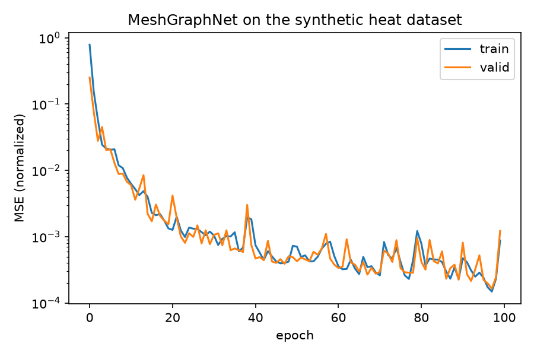
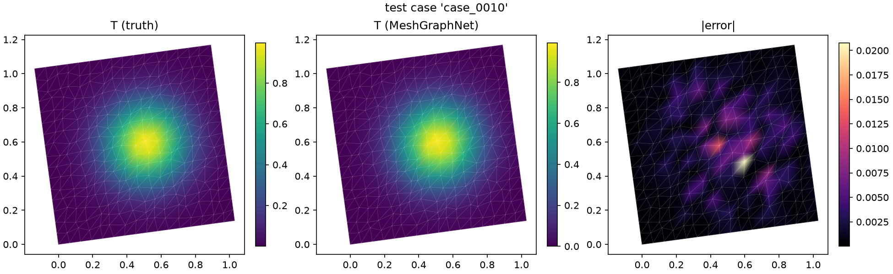

# PhysicsNeMo worked example: simulation output → MeshGraphNet → mesh

The end-to-end path [roadmap §1](../../doc/roadmap.md) asked for, executed for
real: synthetic solver output → meshio++ preprocessing (a
[settings pipeline](../../doc/pipeline.md)) → a curated
[dataset manifest](../../doc/datasets.md) → PhysicsNeMo MeshGraphNet training
through the [adapter](../../doc/physicsnemo.md) → predictions written back as
ordinary `point_data` and rendered. The committed stats files and renders are
the outputs of a real GPU run (see the bottom of this page).

## The problem

~200 cases of a manufactured steady-heat (Poisson) pair on jittered,
randomly-transformed triangle meshes of the unit square: the target `T` is a
Gaussian bump with per-case centre/width, and the input `q = -∆T` is its
**exact analytic source**, so `q → T` is a real PDE mapping — easy enough to
learn in minutes on a small GPU, real enough that a broken pipeline shows up
as a broken prediction. Every case's parameters ride the manifest as entry
`Metadata`.

## Running it

Environment (there is deliberately no pip extra — see
[the packaging note](../../doc/physicsnemo.md#installation-deliberately-no-physicsnemo-extra)):

```bash
pip install meshioplusplus nvidia-physicsnemo torch_geometric matplotlib
# MeshGraphNet's GNN layers additionally require torch_scatter, whose prebuilt
# wheels lag torch releases — pin torch to a version with a matching wheel:
pip install "torch==2.12.0" --index-url https://download.pytorch.org/whl/cu130
pip install torch-scatter -f https://data.pyg.org/whl/torch-2.12.0+cu130.html
```

Then, from this directory:

```bash
python generate_cases.py                    # cases_raw/: 200 .vtu + params
meshioplusplus pipeline preprocess.json     # cases/: the settings-document recipe
python make_manifest.py                     # dataset_manifest.json via the CLI
python train.py                             # runs/example/: stats, checkpoints, metrics
python infer.py                             # predictions/*.vtu + renders
```

Or drive the same trainer without these scripts at all — from a spec file
(`python -m meshioplusplus.physicsnemo.train --spec runs/example/spec.json`),
or from the [dataset dashboard](../../doc/dashboard.md#launching-and-monitoring-a-run)'s
*Start training* button against a running `meshioplusplus-mcp --http`.

Each stage is one of the shipped surfaces, nothing bespoke:

- **`generate_cases.py`** builds each case with meshio++ operations
  (`convert_cells(simplexify)`, `transform`) and writes plain `.vtu`.
- **`preprocess.json`** is a [sequence pipeline document](../../doc/sequences.md)
  (`DataCalc` derives the scaled input, `DataCondition` clamps the target) —
  the preprocessing is a reviewable artefact, not notebook cells.
- **`make_manifest.py`** catalogues the preprocessed cases with the real
  `meshioplusplus dataset add` / `dataset split --assign
  train=0.8,valid=0.1,test=0.1 --seed 0` CLI — the manifest is hand-editable
  JSON and stays the single source of truth.
- **`train.py`** is a thin wrapper: it builds a
  [training spec](../../doc/physicsnemo.md#training-and-prediction) and calls
  `mpn.run_training`, the shipped trainer — the same one
  `python -m meshioplusplus.physicsnemo.train` and the dashboard's *Start
  training* run, so this example cannot drift from the library. The trainer
  streams the normalization stats from the manifest
  (`field_stats`/`edge_stats`, in PhysicsNeMo's own `node_stats.json` /
  `edge_stats.json` key convention), builds the PyG dataset with
  `make_dataset(manifest, split="train")`, and trains
  `physicsnemo.models.meshgraphnet.MeshGraphNet`. **Training uses the PyG
  path deliberately**: MeshGraphNet consumes PyG `Data`, and PyG's
  `DataLoader` batches variable-size graphs natively, which the Gen-2
  TensorDict pipeline has no convention for. Everything the run writes lands
  in `runs/example/` — `metrics.jsonl`, `progress.json`, the stats, and
  `checkpoints/` (periodic `save_checkpoint` state plus `best.mdlus` and
  `final.mdlus`, each with its **model card**). This script adds only the
  loss-curve figure, read back from `metrics.jsonl`.
- **`infer.py`** calls `mpn.predict` with the best checkpoint: it loads the
  card, checks the recorded feature schema against what the mesh yields (the
  drift guard), and writes `T_pred`/`T_error` back into `.vtu` files any mesh
  tool can open. This script adds only the panel below.

The stats files committed at the top of this directory are copies of that
run's own (`runs/example/` is generated, and gitignored).

## Results





Real numbers from the committed run: 100 epochs over 160 training graphs in
**50.3 s**, normalized MSE 7.9×10⁻¹ → 1.6×10⁻⁴ (best validation, epoch 97),
and a **mean RMSE of 0.0027** over the 20 held-out test cases on a field of
amplitude 1.

Executed on: NVIDIA RTX 2000 Ada Generation Laptop GPU (8 GB, WSL2),
2026-09-04 — `nvidia-physicsnemo` 2.1.1, torch 2.12.0+cu130,
torch_geometric 2.8, torch_scatter 2.1.2, meshio++ v10.24.0.
Public CI runs none of this (no GPU, no torch on the runners — the
[GPU-handoff precedent](../../doc/gpu.md#testing-and-ci)); the committed
outputs are how the path is shown to work.
